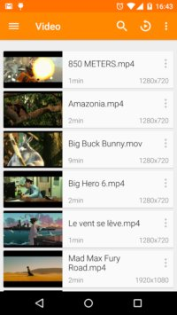
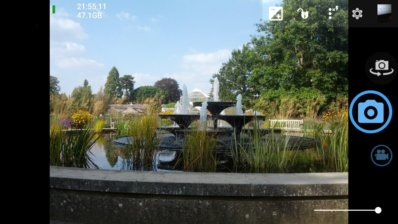
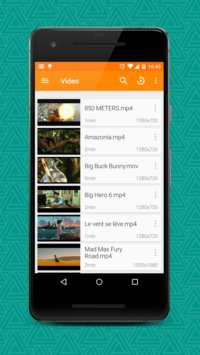
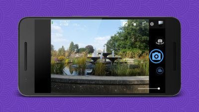

# Device-Art-Generator
A tool to create "device art" images.

**TL;DR:** from this...

 

  

...to this:

  

   


## Getting Started

These instructions will get you a copy of the project up and running on your local machine.

### Prerequisites

This script use:

- [ImageMagick](https://www.imagemagick.org/script/index.php) to manipulate images
- [./jq](https://stedolan.github.io/jq/) to process JSON files

You can install them on an Ubuntu-based distribution with apt-get:

```shell
$ apt-get install imagemagick jq
```

### Set up

Clone this repository: 

```shell
$ git clone https://github.com/legz/Device-Art-Generator.git
```

Or download it here: [Repo ZIP file](https://github.com/legz/Device-Art-Generator/archive/master.zip)

### Usage

#### Run

Just run the script in a terminal:

```
$ ./dag.sh
Preparing background 1... (./images/backgrounds/Background1.png)
Preparing background 2... (./images/backgrounds/Background2.png)
Preparing background 3... (./images/backgrounds/Background3.png)
Preparing background 4... (./images/backgrounds/Background4.png)
09/30/18-18:24:41 - Start screen arts creation
09/30/18-18:24:46 - Screen 1 done. (example-DNS66.png)
09/30/18-18:24:57 - Screen 2 done. (example-open_camera.png)
09/30/18-18:25:04 - Screen 3 done. (example-vlc.png)
09/30/18-18:25:10 - Screen 4 done. (example-yalp_store.png)
09/30/18-18:25:10 - Finished!
```

#### Options

- `-h` : List the available options

```
$ ./dag.sh -h
Available options:
  -d [device_id]	: Device used for framing (pixel_xl by default)
  -m [download|list]: Manage devices:
						- Download them from Android dev website.
						- List the available ones.
```

- `-m` : Manage the devices

```
$ ./dag.sh -m
What would you like to do regarding devices? [download|[list]: d
 Downloading ressources for 'nexus_5x'.
...
 Downloading ressources for 'pixel_2_xl'.
Finished. 12 devices downloaded.
```

```
$ ./dag.sh -m
What would you like to do regarding devices? [download|[list]: l
 This available devices are:
  - nexus_5x
...
  - pixel_2_xl
Check the 'devices' folder for more details.
```

- `-d` : Run the script using a specific device for framing.

```
$ ./dag.sh -d pixel_2_xl
Preparing background 1... (./images/backgrounds/Background1.png)
Preparing background 2... (./images/backgrounds/Background2.png)
Preparing background 3... (./images/backgrounds/Background3.png)
Preparing background 4... (./images/backgrounds/Background4.png)
09/30/18-18:25:39 - Start screen arts creation
09/30/18-18:25:44 - Screen 1 done. (example-DNS66.png)
09/30/18-18:25:55 - Screen 2 done. (example-open_camera.png)
09/30/18-18:26:02 - Screen 3 done. (example-vlc.png)
09/30/18-18:26:08 - Screen 4 done. (example-yalp_store.png)
09/30/18-18:26:08 - Finished
```


## License

This project is licensed under the [GNU GPLv3](https://choosealicense.com/licenses/gpl-3.0/) - see the [LICENSE](LICENSE) file for details


